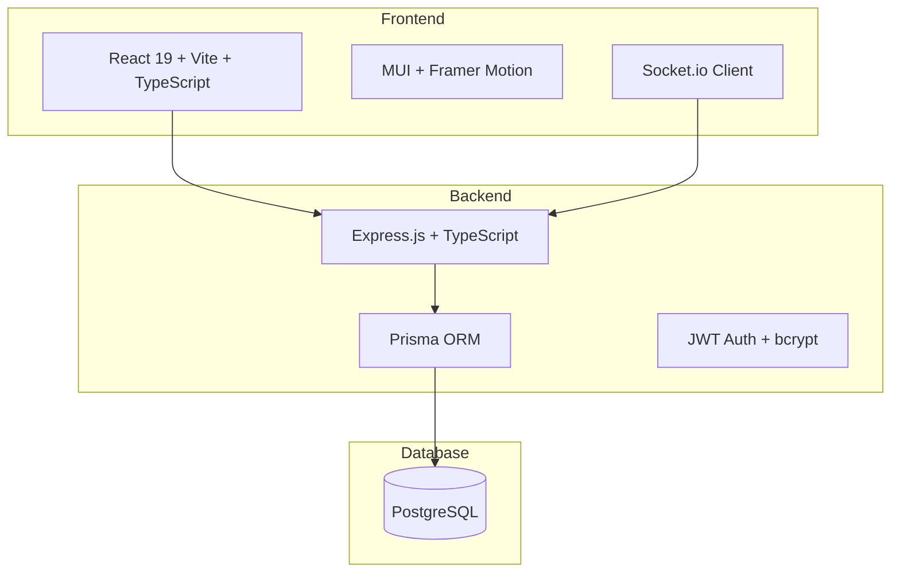
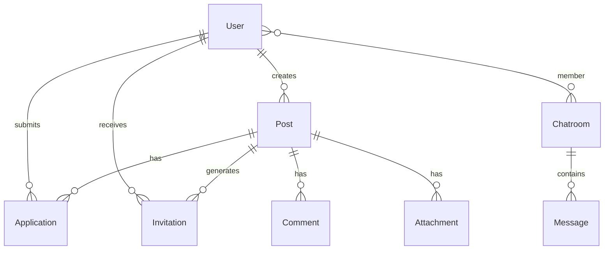
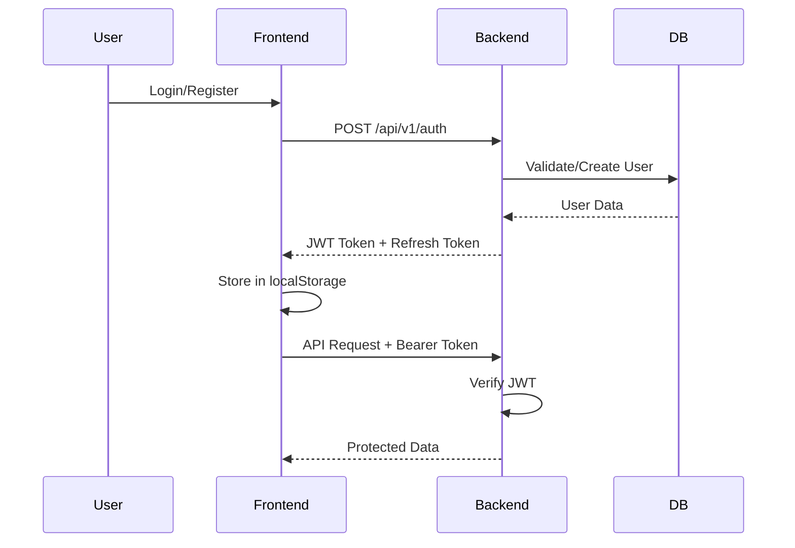

# UnitEd/Pro_Gram - Complete Codebase Walkthrough

## Project Overview

**UnitEd** is a full-stack **Academic Collaboration Network** designed for universities to connect students and faculty for research work, projects, and hackathons. Think of it as **LinkedIn meets GitHub meets Slack** for academic collaboration.

**Repository:** [https://github.com/Pavan200312/Pro_Gram](https://github.com/Pavan200312/Pro_Gram)

---

## 🏗️ Architecture Overview



---

## 📁 Project Structure

```
Pro_Gram/
├── src/                    # Frontend React Application
│   ├── App.tsx             # Main app with routing
│   ├── components/         # Reusable UI components (39 files)
│   ├── pages/              # Page components (36 files)
│   ├── services/           # API & business logic (15 files)
│   ├── contexts/           # React contexts (Auth, etc.)
│   ├── theme/              # MUI theme customization
│   ├── types/              # TypeScript type definitions
│   └── utils/              # Utility functions
│
├── backend/                # Backend API Server
│   ├── src/
│   │   ├── index.ts        # Express server entry
│   │   ├── routes/         # API route definitions
│   │   ├── controllers/    # Request handlers
│   │   ├── services/       # Business logic
│   │   ├── middleware/     # Auth, validation, etc.
│   │   └── types/          # TypeScript types
│   └── prisma/
│       └── schema.prisma   # Database schema (11 models)
│
└── public/                 # Static assets
```

---

## ⚙️ Technology Stack

### Frontend
| Technology | Version | Purpose |
|------------|---------|---------|
| React | 19.2.0 | UI Framework |
| Vite | 7.2.1 | Build Tool |
| TypeScript | 5.9.3 | Type Safety |
| MUI (Material-UI) | 7.3.5 | Component Library |
| Framer Motion | 12.23.24 | Animations |
| React Router DOM | 7.9.5 | Client Routing |
| Socket.io Client | 4.8.1 | Real-time Communication |
| Lucide React | 0.552.0 | Icons |

### Backend
| Technology | Version | Purpose |
|------------|---------|---------|
| Express | 4.18.2 | Web Framework |
| Prisma | 5.8.0 | ORM |
| PostgreSQL | - | Database |
| JWT | 9.0.3 | Authentication |
| bcryptjs | 2.4.3 | Password Hashing |
| Helmet | 7.1.0 | Security Headers |
| CORS | 2.8.5 | Cross-Origin Support |
| Morgan | 1.10.0 | HTTP Logging |

---

## 🗄️ Database Schema (11 Models)



### Core Models

| Model | Purpose |
|-------|---------|
| **User** | Students & Faculty with profiles, skills, social links |
| **Post** | Projects, research opportunities, internships, competitions |
| **Application** | Job/project applications with status tracking |
| **Invitation** | Direct invitations to users for opportunities |
| **Chatroom** | Group messaging for post teams |
| **Message** | Chat messages within chatrooms |
| **Comment** | Comments on posts |
| **Attachment** | File attachments on posts |
| **SocialLink** | User social media links (GitHub, LinkedIn, etc.) |
| **TeamMember** | Post team membership with roles |
| **Notification** | User notifications |

### User Roles
- **STUDENT** - Can apply to posts, create projects
- **FACULTY** - Can create research opportunities, mentor students

### Post Categories
`PROJECT` | `RESEARCH` | `INTERNSHIP` | `COMPETITION` | `WORKSHOP` | `OTHER`

### Post Statuses
`DRAFT` | `OPEN` | `IN_PROGRESS` | `CLOSED` | `CANCELLED`

---

## 🔐 Authentication Flow



---

## 📄 Frontend Pages (36 Pages)

### Public Routes
| Route | Component | Purpose |
|-------|-----------|---------|
| `/` | `LandingPageNew` | Marketing landing page |
| `/login` | `LoginNew` | User authentication |
| `/register` | `RoleSelection` | Choose Student/Faculty |
| `/register/student` | `StudentRegister` | Student registration form |
| `/register/faculty` | `FacultyRegister` | Faculty registration form |
| `/forgot-password` | `ForgotPassword` | Password recovery |

### Protected Routes (Require Authentication)
| Route | Component | Purpose |
|-------|-----------|---------|
| `/home` | `Home` | Main feed/dashboard |
| `/dashboard` | `Dashboard` | User dashboard |
| `/profile` | `Profile` | User profile view |
| `/settings` | `Settings` | Account settings |
| `/settings/profile` | `ProfileSettings` | Profile editing |
| `/create-post` | `CreatePostMultiStep` | Multi-step post creation |
| `/my-posts` | `MyPosts` | User's created posts |
| `/matched-posts` | `SkillMatchedPosts` | AI-matched opportunities |
| `/post/:id` | `PostDetailPage` | Post details |
| `/post/manage/:id` | `PostManagePage` | Manage own post |
| `/post/:postId/candidates` | `RecommendedCandidatesPage` | View applicants |
| `/applications` | `Applications` | Received applications |
| `/applied` | `AppliedOpportunities` | Applied posts |
| `/accepted-applications` | `AcceptedApplications` | Accepted applications |
| `/invitations` | `Invitations` | Received invitations |
| `/chatrooms` | `Chatrooms` | Chat list |
| `/chatroom/:id` | `ChatroomPage` | Chat conversation |
| `/forums` | `Forums` | Discussion forums |
| `/forum/:threadId` | `ForumThread` | Forum thread |
| `/forum/create` | `CreateThread` | Create forum thread |
| `/notifications` | `Notifications` | User notifications |
| `/profile/:id` | `UserProfile` | View other user profile |
| `/about` | `About` | About page |

---

## 🧩 Component Architecture

### Design System Components (17)
| Component | Purpose |
|-----------|---------|
| `Button` | Styled button variants |
| `Card` | Container component |
| `Input` | Form input field |
| `Select` | Dropdown selection |
| `Modal` | Dialog/popup |
| `Avatar` | User avatar display |
| `Badge` | Status/count badges |
| `Tooltip` | Hover tooltips |
| `Tabs` | Tab navigation |
| `Switch` | Toggle switch |
| `Grid/Flex` | Layout components |
| `LoadingSpinner` | Loading state |
| `LazyImage` | Optimized image loading |
| `AnimatedComponents` | Framer Motion wrappers |

### Landing Page Components (7)
`HeroSection` | `FeaturesSection` | `AboutSection` | `WorkflowSection` | `TestimonialsSection` | `Footer` | `PublicNavbar`

### Layout Components (3)
`MainLayout` | `PrivateRoute` | Navigation

---

## 🔌 API Endpoints

### Base URL: `/api/v1`

### Posts API
| Method | Endpoint | Description |
|--------|----------|-------------|
| GET | `/posts` | List all posts |
| GET | `/posts/:id` | Get post details |
| POST | `/posts` | Create new post |
| PUT | `/posts/:id` | Update post |
| DELETE | `/posts/:id` | Delete post |

### Invitations API
| Method | Endpoint | Description |
|--------|----------|-------------|
| GET | `/invitations` | List user invitations |
| POST | `/invitations` | Send invitation |
| PUT | `/invitations/:id/respond` | Accept/reject |
| DELETE | `/invitations/:id` | Cancel invitation |

---

## 🛡️ Security Features

- **JWT Authentication** with refresh tokens
- **Helmet.js** for security headers
- **CORS** configuration
- **Rate Limiting** (express-rate-limit)
- **Password Hashing** with bcrypt
- **Input Validation** with express-validator
- **Secure Storage** service for sensitive data
- **Storage Security Monitor** for client-side security

---

## 🚀 Running the Project

### Frontend
```bash
cd united_with_Landing_page
npm install
npm run dev
# Runs on http://localhost:5173
```

### Backend
```bash
cd backend
npm install
cp .env.example .env
# Edit .env with database credentials
npx prisma migrate dev
npm run dev
# Runs on http://localhost:5000
```

---

## 📊 Key Services

### Frontend Services (15)
| Service | Purpose |
|---------|---------|
| `authApiService` | Authentication API calls |
| `localStorageAuthService` | Local auth state management |
| `applicationService` | Job applications CRUD |
| `chatroomService` | Chat functionality |
| `invitationService` | Invitation management |
| `notificationService` | Push notifications |
| `postLifecycleService` | Post status management |
| `emailService` | Email sending |
| `secureStorageService` | Encrypted local storage |
| `storageSecurityMonitor` | Security monitoring |

---

## ✅ Summary

**UnitEd/Pro_Gram** is a production-ready academic collaboration platform with:

- **Full-stack TypeScript** codebase
- **36+ pages** covering complete user flows
- **11 database models** for comprehensive data modeling
- **Real-time messaging** with Socket.io
- **Modern UI** with MUI and Framer Motion animations
- **Secure authentication** with JWT and refresh tokens
- **Role-based access** for Students and Faculty
- **Skill matching** for opportunities
- **Forum discussions** for community engagement

The codebase follows industry best practices with clear separation of concerns, comprehensive error handling, and extensive security measures.
